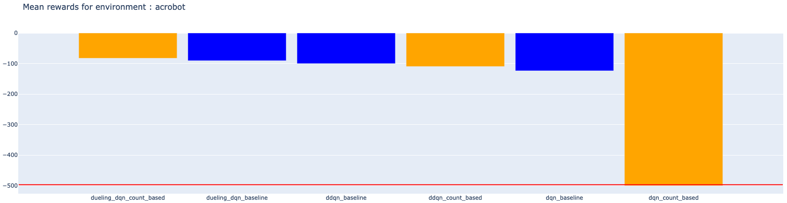
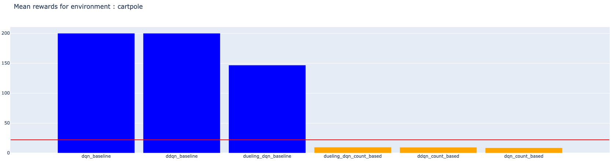
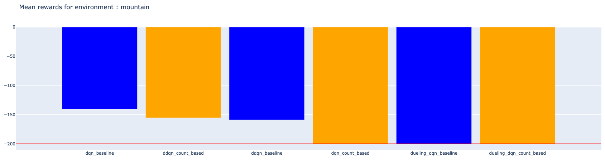

# Count-Based Exploration
Our version of #Exploration: A Study of Count-Based Explorationfor Deep Reinforcement Learning for a class project : https://arxiv.org/pdf/1611.04717v3.pdf

This aim of the project was to implement the count-based exploration with the static hashing with Deep RL algorithms. 

We study the differences between the epsilon-greedy exploration for 2 tabular RL algorithms (Q-learning and Sarsa) and 3 Deep RL algorithms (DQN, DDQN and Dueling DQN). 

Here are some results of our work : 

| Acrobot | Cartpole | Mountain | 
|---| --- | --- |
|  |  |    |
| Dueling DQN with count based exploration | DDQN with epsilon-greedy exploration  | DDQN with count based method | 

# Count-based 

The count-based exploration uses a static hashing to map continuous states into discrete state, and then count the number of times a given state has been visited. 
Then, the classic RL algorithms are trained with a bonus reward that takes into account the number of times we have visited the state. This bonus reward plays the role of the exploration. 

## Static hashing

The static hashing maps the continuous states into discrete with a A matrix which is drawn from normal distribution as explained in the following figure. 

| Static hashing |  
|---| 
|  | 

## Counting 

Once we have discretize the continuous states, we use a dictionnary to count the number of times we have visited a given state. There are two hyperparameters that are used in the algorithm : 
- `beta` : Tells how important we consider the bonus reward
- `k` : The granularity of the static hashing. It should be sparse enough to keep distant non close states but not too much to merge the close states in the continuous space. 

| Count-based |  
|---| 
|  | 

# Description 

- `gif` : The gif folder where all the results of the models are saved
- `images` : The images used for either the notebooks or the report
- `models` : The models parameters 
- `notebooks` : The notebooks used during the project
- `python` : The python files used (like the architectures of the models)
- `report` : The directory where the final report is 
- `requirements.txt` : The version of the library used
- `results` : The results of the training 
- `zip` : A zip file where the `gif`, `models`, `python` and `results` are compressed to be used in a notebook

# Results 

We have trained 2 tabular methods (Q-learning and Sarsa) and 3 Deep RL methods (DQN, DDQN and Dueling DQN) on 4 different environments : Taxi, Acrobot, Cartpole and Mountain Car. 

We have trained each model on the environments with 10 SEEDS and stored the rewards. After that, we plot the average rewards and the variance of the rewards over the episodes. 

We have trained our models with the same hyperparameters for both epsilon-greedy and count based explorations. The hyperparameters are summarised in the `Summary.ipynb` notebook. 

## Taxi 

#### Rewards

Here are the rewards for Q-learning and Sarsa. 

| Q-learning | Sarsa |  
|---| --- | 
|  |  | 
 
### Histograms 

Here are the histograms of the states for both Q-learning and Sarsa for the count-based method 

| Q-learning | Sarsa |  
|---| --- | 
|  |  | 

The histograms of the states are quite balanced and the rewards show that both methods of exploration work well. 

## Acrobot 

### Rewards

Here are the rewards for DQN, DDQN and Double DQN for the Acrobot environment. 

| DQN | DDQN | Dueling DQN |  
|---| --- | --- | 
|  |  |  |

All the methods work well, and it seems that the count-based methods is slightly faster than the epsilon-greedy exploration. 

### Histograms 

Here are the histograms of the states for DQN, DDQN and Dueling DQN 

| DQN | DDQN | Dueling DQN |   
|---| --- | --- | 
|  |  |  |

We see that few states are more visited than others, but the behaviour seems correct and the model has learnt well. 

### Simulation 

Here is the simulation with the model of SEED 77 on 10 instances of the environment. 

| Random |DQN (count-based) | DDQN (count-based) | Dueling DQN (count-based) |   
|--- | ---| --- | --- | 
|| |  |  |
| Random |DQN (epsilon-greedy) | DDQN (epsilon-greedy) | Dueling DQN (epsilon-greedy) |    
|| |  |  |

They all perform well except the count-based DQN. It should be explain by the fact we used the model trained on SEED 77, and could have had struggle to learn because of bad initialisation. 

#### Average rewards

Here are the average rewards on 10 instance of the environment 

| Mean rewards | 
| --- | 
| |

## Cartpole 

### Rewards

Here are the rewards for DQN, DDQN and Double DQN for the Cartpole environment. 

| DQN | DDQN | Dueling DQN |  
|---| --- | --- | 
|  |  |  |

The count-based method doesn't work well for this environment. It could be explain by a bad static hashing due to the fact that there aren't a lot of dimensions on the original continuous state space. 

### Histograms 

Here are the histograms of the states for DQN, DDQN and Dueling DQN

| DQN | DDQN | Dueling DQN |   
|---| --- | --- | 
|  |  |  |

As there is logarithm scale, we should consider that some states are highly more visited than others. It could explain than too much states are discretize into same representation, which unable the model to explore well.  

### Simulation 

Here is the simulation with the model of SEED 77 on 10 instances of the environment. 

| Random |DQN (count-based) | DDQN (count-based) | Dueling DQN (count-based) |   
|--- | ---| --- | --- | 
|| |  |  |
| Random |DQN (epsilon-greedy) | DDQN (epsilon-greedy) | Dueling DQN (epsilon-greedy) |    
|| |  |  |

Only the epsilon-greedy version performs well. The discretisation with the static hashing isn't sufficiently granular. 

#### Average rewards

Here are the average rewards on 10 instance of the environment 

| Mean rewards | 
| --- | 
| |

The count-based method isn't working for this environment. 

## Mountain car 

### Rewards

Here are the rewards for DQN, DDQN and Double DQN for the Mountain car environment. 

| DQN | DDQN | Dueling DQN |  
|---| --- | --- | 
|  |  |  |

The count-based method outperforms the epsilon-greedy exploration for both DQN and DDQN, but not for Dueling DQN. Such a behaviour should be explain by some struggles in the choise of the count-based hyperparameters. 

### Histograms 

Here are the histograms of the states for DQN, DDQN and Dueling DQN

| DQN | DDQN | Dueling DQN |   
|---| --- | --- | 
|  |  |  |

We see that there are around 30 different discrete states for DQN and DDQN, and 4 times more for Dueling DQN. Maybe the bad behaviour of the Dueling DQN could be explain by the sparsity of the static hashing. 

### Simulation 

Here is the simulation with the model of SEED 77 on 10 instances of the environment. 

| Random |DQN (count-based) | DDQN (count-based) | Dueling DQN (count-based) |   
|--- | ---| --- | --- | 
|| |  |  |
| Random |DQN (epsilon-greedy) | DDQN (epsilon-greedy) | Dueling DQN (epsilon-greedy) |    
|| |  |  |

Only the Dueling DQN with count-based exploration doesn't solve the environment. 

#### Average rewards

Here are the average rewards on 10 instance of the environment 

| Mean rewards | 
| --- | 
| |

The results are quite ambiguous for this environment : this is DQN with epsilon-greedy exploration that solves the best the environment. 
The count-based exploration tends to be efficient but not strongly better than the epsilon-greedy exploration. 

# Conclusion 

- In this work, we explored a tabular exploration method that could be extended for continuous state space.
The count-based exploration aims to explore by adding a reward that considers the number of times the agent has visited a given state. Such a state that has been mapped with a hashing function in order to convert it from continuous space into discrete space. The static hashing is the main bottleneck of this exploration method : it should compress enough in order to map close states in the continuous space into the same discrete representation. 

- We achieved to implement such exploration and succeeded in outperforming epsilon-greedy exploration for the acrobot and mountain car environments, but we didn't succeed with cartpole and the Dueling DQN algorithm with mountain car environment. 

- Such conclusion leads to the fact that the choice of hashing function is really important. A good improvement could be the learning hashing mentioned in the paper, which is much more challenging as the hashing is changing during the training process.

- Another limitation of our work is the fact that we didn't implement the same deep RL algorithm than the paper (TRPO). Therefore, the comparison with the papers are limited, added to the fact that we didn't implement all the environments that are too expensive to train.

